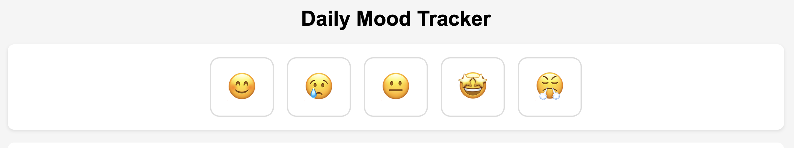
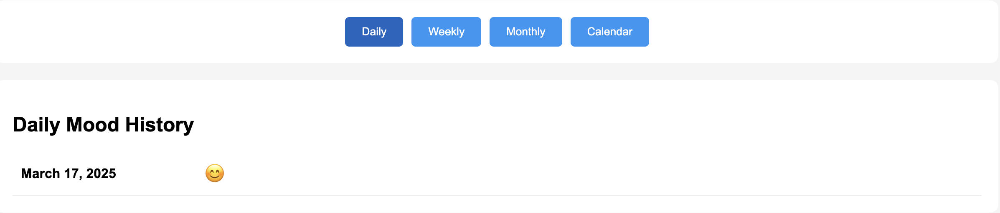
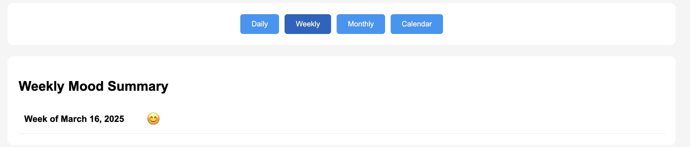
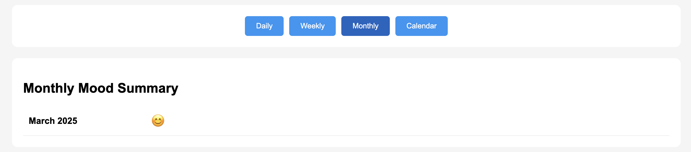
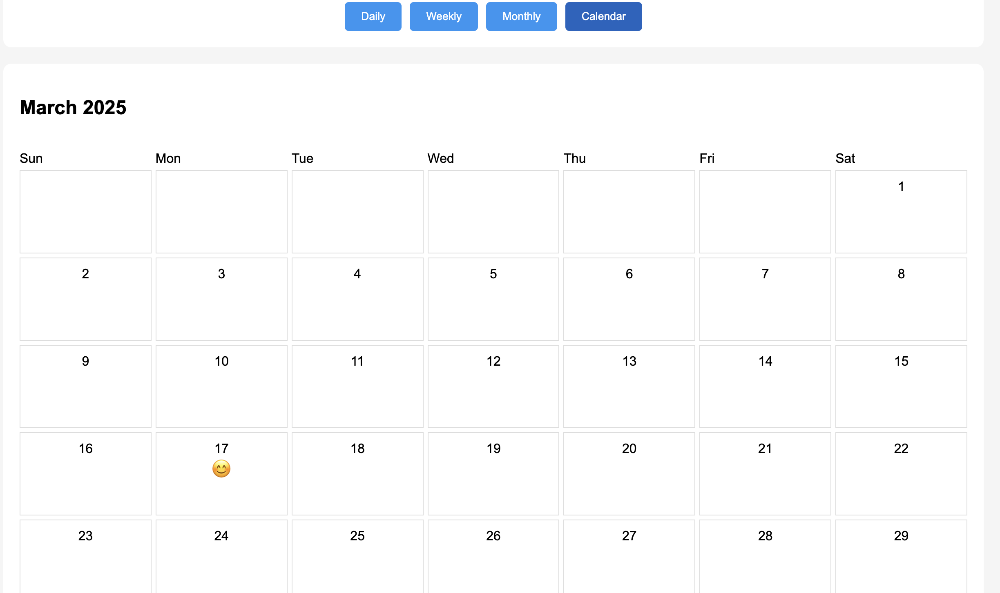

# Mood Tracker

## Overview

Mood Tracker is a simple web-based application that allows users to log and track their daily mood using emojis. The goal of this project is to help users monitor their emotional trends over time and reflect on their emotional well-being.

## Live Demo

Check out the live demo of the Mood Tracker app here: [Mood Tracker - Live Demo](https://master-ji-hulp.vercel.app/)

### Features:
- **Select Mood Emoji**: Users can select from a variety of mood emojis (happy, sad, neutral, excited, etc.) to reflect their emotional state for the day.
- **Mood Log Storage**: Mood logs are stored locally using LocalStorage, ensuring persistence across page reloads.
- **Timeline View**: View past moods in a timeline format to track mood patterns.
- **Day/Week/Month View**: Users can filter the timeline to view their mood data on a daily, weekly, or monthly basis.
- **Bonus Feature**: Calendar View (Optional) – Displays moods in a calendar format for easier tracking.

## How to Use

1. **Set Your Mood**: 
   - Upon accessing the app, select the emoji that best represents your mood for the day.
   
2. **Save Your Mood**: 
   - Click the "Log Mood" button to save your daily mood entry.

3. **View Timeline**: 
   - The app provides a timeline view of past mood logs.
   - You can toggle between day, week, or month views to track trends over time.

4. **Check Calendar View (Optional)**: 
   - If the calendar view feature is enabled, see your moods mapped out on a calendar for a more visual overview.

## Technologies Used

- **HTML5** – Markup language for structure.
- **CSS3** – Styling for layout and design.
- **JavaScript** – Logic for mood tracking, storing data in LocalStorage, and generating views.
- **LocalStorage** – Used to persist mood logs across page reloads.
  
## Setup Instructions

1. Clone the repository:

    ```bash
    git clone https://github.com/aman97kumar/Assignment.git

    ```

2. Navigate into the project directory:

    ```bash
    cd Assignment_1
    ```

3. Open `index.html` in your browser to start using the app.

4. The mood data will be saved in your browser's LocalStorage, so make sure LocalStorage is enabled in your browser.

## Screenshots

### Mood View:


### Day View:


### Week View:


### Month View:


### Calendar View:


## Contributing

Feel free to fork the repository and submit pull requests with improvements or fixes.

## License

This project is licensed under the MIT License - see the [LICENSE](LICENSE) file for details.

## Acknowledgements

- Thanks to all contributors who help make this project better!
